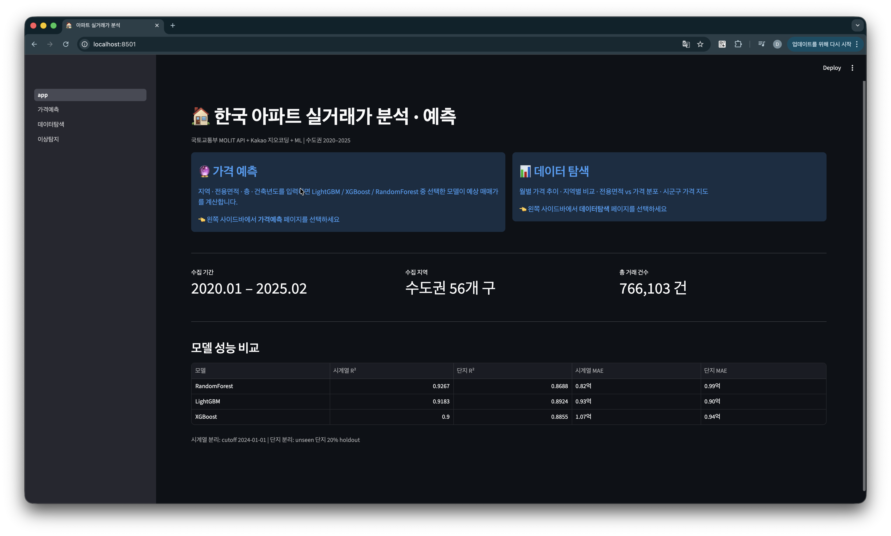

# 🏠 한국 아파트 실거래가 분석 파이프라인

국토교통부 실거래가 API로 수도권 아파트 매매 데이터를 수집하고,  
Kakao 지오코딩 + 공간 피처 엔지니어링 + ML 앙상블로 가격을 예측하며,  
Isolation Forest로 이상 거래를 탐지하는 end-to-end 데이터 파이프라인입니다.

> **데이터**: 수도권 아파트 매매 1,129,994건 (2020.01 – 2026.04)

---

## 📸 대시보드 스크린샷

**홈**


| 가격 예측 | 월별 가격 추이 |
|-----------|--------------|
|  |  |

| 가격 지도 (Choropleth) | 이상탐지 — 거래유형 분석 |
|-----------------------|--------------------------|
|  |  |

| 이상탐지 — 단지별 집중도 | |
|--------------------------|--|
|  | |

---

## 📊 대시보드 구성

### 🏠 홈 (app.py)
프로젝트 개요와 3개 모델(LightGBM · XGBoost · RandomForest)의 성능을 시계열/단지 분리 방식별로 비교한 요약 테이블을 제공합니다.

---

### 🔮 가격 예측 (pages/1_가격예측.py)

**사이드바 입력**
- 예측 모델 선택: LightGBM / XGBoost / RandomForest × 시계열/단지 분리 (6가지 조합)
- 지역(시도·구), 전용면적, 층, 건축년도, 거래 연월, 거래 유형 입력

**예측 결과**
- 예상 매매가 (만원 / 억원)
- 건물 연령, 최근접 지하철역 거리, 강남역 거리 지표
- 선택 지역의 실거래 시세 비교 (평균·최저·최고·예측 대비 %)

**SHAP 모델 해석**
- 전체 피처 영향도: 2,000건 샘플 기준 평균 |SHAP| 수평 막대 차트
- 이 예측 설명: 현재 입력 조건에서 각 피처가 예측가에 기여하는 억원 단위 기여도 (빨강=가격 상승, 파랑=가격 하락)
- Ridge 등 선형 모델은 TreeExplainer 미지원으로 SHAP 미제공

> SHAP(SHapley Additive exPlanations)은 각 피처가 예측에 얼마나 기여했는지를 게임이론 기반으로 설명합니다.

---

### 📊 데이터 탐색 (pages/2_데이터탐색.py)

- **월별 가격 추이**: 지역·면적대별 평균 매매가 시계열
- **지역별 비교**: 구 단위 평균 매매가 랭킹
- **면적 vs 가격 산점도**: 전용면적과 거래가의 관계
- **시군구 가격 지도**: Choropleth 지도로 수도권 가격 분포 시각화

---

### 🚨 이상 탐지 (pages/3_이상탐지.py)

- **거래 유형 분석**: 이상 거래에서 직거래 비율이 정상 거래 대비 2.2배 높음을 확인
- **지역별 현황**: 구별 이상 거래 건수 및 비율
- **단지별 집중도**: 특정 단지에 이상 거래가 집중되는 패턴 분석
- **실무 활용 가이드**: 시세 산정·담보대출 심사·특수관계인 탐지·급매 탐지 적용 방법

---

## 🔍 주요 인사이트

### 1. 가격 예측 모델 — 분리 방식별 성능 비교

> **핵심 질문**: "같은 모델이 알고 있는 단지(시계열)와 처음 보는 단지(단지 분리)에서 각각 얼마나 잘 예측하는가?"

| 모델 | 시계열 R² | 단지 R² | 시계열 MAE | 단지 MAE |
|------|---------|---------|----------|---------|
| RandomForest | **0.887** | 0.859 | 1.23억 | 1.17억 |
| LightGBM | 0.880 | **0.883** | 1.28억 | **1.07억** |
| XGBoost | 0.857 | 0.878 | 1.42억 | 1.12억 |

> 시계열 분리: cutoff 2025-01-01 (테스트셋 2025~2026) | 단지 분리: unseen 단지 20% holdout

**해석**
- 2025~2026 테스트셋 기준으로 전반적인 R² 하락 — 금리 인하 기대 + 시장 회복기의 가격 변동성이 커서 예측 난도가 높아졌습니다.
- LightGBM·XGBoost는 단지 분리 R²가 시계열보다 높습니다 — 최근 시장 급등기에 좌표 암기 효과보다 지역 패턴 추론이 더 안정적임을 시사합니다.
- RandomForest는 여전히 시계열 R²가 단지보다 높아, 좌표 암기 의존도가 상대적으로 강합니다.

#### 두 분리 방식의 차이

| | 시계열 분리 | 단지 분리 |
|--|-----------|---------|
| **분리 기준** | 날짜 (cutoff 2025-01-01) | 아파트 단지 ID (`apt_name + lawd_cd`) |
| **테스트 조건** | 학습에 있던 단지, 미래 시점 | 학습에 없던 단지 (14,273개 중 20%) |
| **측정하는 것** | 시장 흐름 예측력 | 처음 보는 위치 일반화 능력 |
| **적합한 상황** | 기존 단지 시세 조회·담보 평가 | 신규 단지·분양가 추정·모델 일반화 성능 주장 |

**시계열 분리**

이점
- **미래 데이터 누수 방지**: 2024년 가격 정보가 2023년 학습에 스며들지 않습니다. 단지 분리는 2024년 A단지를 train에, 같은 2024년 B단지를 test에 써서 시간 방향이 뒤섞입니다.
- **시장 흐름 변화 측정**: 금리 인상·규제 변화 같은 시장 전체의 패턴 변화에 모델이 얼마나 잘 반응하는지 볼 수 있습니다. 단지 분리로는 이를 측정할 수 없습니다.
- **실제 서비스 상황과 동일**: 배포된 모델은 항상 "과거로 학습 → 미래 예측"을 합니다. 시계열 분리가 이 상황을 그대로 재현합니다. R² 0.918은 이미 알고 있는 단지라면 실제로 그 정도로 잘 맞힌다는 의미입니다.

단점
- **성능이 낙관적으로 측정됨**: 모델이 학습 때 본 단지의 위도·경도를 기억한 채 같은 단지를 다시 예측하므로, 위치 암기 효과가 R²를 끌어올립니다. 실제 일반화 능력보다 수치가 높게 나옵니다.
- **신축·미등록 단지 성능 보장 불가**: test에 처음 보는 단지가 없으므로, 모델이 새 단지를 얼마나 잘 추정하는지 알 수 없습니다. → **단지 분리로 보완**

---

**단지 분리**

이점
- **좌표 암기 효과 제거**: 시계열 분리에서 높은 R²는 모델이 학습 때 본 단지의 위도·경도를 그대로 기억해서 생기는 유리함이 포함됩니다. 단지 분리는 이 효과를 차단하고 순수한 일반화 능력만 측정합니다.
- **신축·미등록 단지 예측 적합**: 한 번도 본 적 없는 단지의 좌표를 받았을 때 인근 패턴으로 추론하도록 훈련됩니다. 분양가 추정, 신규 개발지 시세 예측에 더 신뢰할 수 있는 모델이 만들어집니다.
- **정직한 성능 지표**: 포트폴리오나 실무 보고에서 "처음 보는 단지도 R² 0.89로 맞힌다"는 주장이 "알던 단지를 R² 0.92로 맞힌다"보다 더 강한 증거입니다.

단점
- **시간 흐름 무시**: 2020년 데이터로 학습하면서 같은 해 다른 단지의 2024년 거래를 test로 쓸 수 있습니다. 시장 상황이 다른 시점의 데이터가 섞여 시계열 패턴 측정이 불가능합니다.
- **성능이 보수적으로 측정됨**: 실제 서비스에서는 이미 알고 있는 단지를 예측하는 경우가 대부분인데, 단지 분리 성능만 보면 모델 능력을 과소평가할 수 있습니다. → **시계열 분리로 보완**

---

> 두 방식은 서로의 단점을 보완합니다.  
> 시계열 분리가 낙관적인 성능을 측정한다면, 단지 분리가 그 하한선을 잡아줍니다.  
> 단지 분리가 시장 흐름을 무시한다면, 시계열 분리가 실제 배포 상황을 검증해줍니다.  
> **두 수치를 나란히 제시하는 것이 모델 성능을 가장 정직하게 보여주는 방법입니다.**

**피처 중요도 (상위 5개, LightGBM 시계열 기준)**

| 순위 | 피처 | 설명 |
|------|------|------|
| 1 | `latitude` | 위도 (남북 위치) |
| 2 | `longitude` | 경도 (동서 위치) |
| 3 | `dist_to_gangnam_km` | 강남역까지 직선 거리 |
| 4 | `building_age` | 건물 연령 |
| 5 | `area_exclusive` | 전용면적 |

> 위치 피처(위도·경도·강남 거리)가 가격의 40% 이상을 설명 — 한국 부동산 시장에서 입지의 압도적 영향력 확인

---

### 2. 이상 거래 탐지 (Isolation Forest, 구 단위 분리)

> **핵심 발견: 이상 거래에서 직거래 비율이 약 1.9배 높다**

| 구분 | 건수 | 중앙 거래가 | 직거래 비율 |
|------|------|------------|------------|
| 정상 거래 | 1,107,369건 | — | 3.0% |
| 이상 거래 | 22,625건 | **10.3억** | **5.6%** |

**탐지 방법**
- 전체를 한 분포로 보면 강남 고가 아파트가 단순히 이상치로 분류됨
- **구 단위 분리 탐지**로 각 지역 내 시세 기준의 진짜 이상 거래를 탐지
- 활용 피처: 거래가, 평당가, 전용면적, 층, 건물연령, 거래월, 위치 거리 피처

**이상 거래 해석**
- 직거래 비율 5.6% (정상 3.0% 대비 약 1.9배) — 특수관계인 간 저가 거래 또는 급매의 패턴
- 카이제곱 검정으로 통계적 유의성 확인: χ²=1212.8, p<0.001 → 우연이 아닌 구조적 패턴
- 이상치 중앙가 10.3억 — 단순 고가가 아닌 해당 구 내 시세 이탈 거래
- 특정 단지에 이상 거래 집중 현상 존재

**실무 활용**

| 활용 분야 | 적용 방법 | 기대 효과 |
|-----------|----------|-----------|
| 시세 산정 | 이상 거래 제외 후 정상 거래만으로 시세 계산 | 시장 왜곡 없는 신뢰 시세 |
| 담보대출 심사 | 이상 거래 비율 높은 단지에 플래그 부여 | 심사관 추가 검토 유도 |
| 특수관계인 탐지 | 직거래 이상치 우선 필터링 | 세무조사 1차 스크리닝 |
| 급매 탐지 | anomaly_score 하위 거래 추출 | 시세 대비 저가 매물 발굴 |

---

### 3. 공간 피처 엔지니어링

위경도 좌표에서 다음 거리 피처를 생성하여 모델 성능을 향상시켰습니다.

| 피처 | 설명 | 계산 방법 |
|------|------|----------|
| `dist_to_gangnam_km` | 강남역까지 직선 거리 | Haversine |
| `dist_to_subway_km` | 최근접 지하철역까지 거리 | 수도권 ~200개역 기준 |
| `dist_to_cityhall_km` | 최근접 시청/구청까지 거리 | 서울·경기·인천 청사 기준 |

- `dist_to_gangnam_km`: 단순 교통 편의가 아닌 강남 프리미엄 권역과의 거리 (학군·직주근접·자산가치 proxy)
- `dist_to_subway_km`: 역세권 프리미엄 정량화

---

## 🛠 기술 스택

| 영역 | 사용 기술 |
|------|----------|
| 데이터 수집 | Python `requests`, `xml.etree.ElementTree`, `tenacity` |
| 저장 | `SQLite` (증분 저장, UNIQUE 제약으로 중복 방지) |
| 지오코딩 | `Kakao Local API`, `VWorld API` (fallback) |
| 공간 분석 | `geopandas`, `shapely`, `numpy` (Haversine 벡터화) |
| ML | `LightGBM`, `XGBoost`, `scikit-learn` (RandomForest), `Optuna` |
| 모델 해석 | `SHAP` (TreeExplainer — 전체 피처 영향도 + 개별 예측 설명) |
| 이상탐지 | `sklearn.ensemble.IsolationForest` |
| 시각화 | `Streamlit`, `Plotly`, `Folium` |
| CLI | `Click` |
| 로깅 | `Loguru` |

---

## 📁 프로젝트 구조

```
realestate/
├── src/realestate/
│   ├── config.py        # API 키, 지역코드, 경로 설정
│   ├── collector.py     # MOLIT API 수집 (XML 파싱, pagination, retry)
│   ├── preprocessor.py  # 컬럼 정제, 파생 변수 생성
│   ├── storage.py       # SQLite 증분 저장 (apt_trade / apt_geocode / apt_anomaly)
│   ├── geocoder.py      # Kakao/VWorld 지오코딩 (배치, 캐시)
│   ├── spatial.py       # 공간 피처 생성 (지하철·구청 거리, 시군구 조인)
│   ├── ml.py            # MLPipeline (학습, Optuna HPO, 모델 비교, 이상탐지)
│   └── main.py          # Click CLI
├── pages/
│   ├── 1_가격예측.py    # ML 예측 + SHAP 해석 + 지역 시세 비교
│   ├── 2_데이터탐색.py  # 월별추이 / 지역비교 / 면적산점도 / 가격지도
│   └── 3_이상탐지.py    # 거래유형 분석 / 지역별 현황 / 단지별 집중도
├── tests/
│   ├── test_preprocessor.py
│   ├── test_spatial.py
│   └── test_ml.py
├── app.py               # Streamlit 홈
├── .env.example
└── requirements.txt
```

---

## ⚡ 빠른 시작

### 1. 환경 설정

```bash
git clone https://github.com/lh922j/realestate.git
cd realestate
python -m venv .venv && source .venv/bin/activate
pip install -r requirements.txt
cp .env.example .env    # API 키 입력
```

### 2. API 키 발급

**MOLIT API** — [data.go.kr](https://www.data.go.kr) → 아파트매매 실거래 상세 자료 → **일반 인증키(Decoding)**

**Kakao API** — [developers.kakao.com](https://developers.kakao.com) → REST API 키 → 제품 설정 → **카카오맵 지도/로컬 활성화**

### 3. 파이프라인 실행

```bash
# 데이터 수집
python -m src.realestate.main collect --type trade --region 수도권 --start 202001 --end 202604

# 지오코딩
python -m src.realestate.main geocode --region 수도권

# ML 학습 — 시계열 분리 (기본)
python -m src.realestate.main train --model lgbm --cutoff 2025-01-01

# ML 학습 — 단지 분리 (일반화 성능 측정)
python -m src.realestate.main train --model lgbm --complex-split

# 이상 탐지
python -m src.realestate.main anomaly --region 수도권 --contamination 0.02

# 대시보드
streamlit run app.py
```

---

## 📊 CLI 명령어

| 명령어 | 설명 |
|--------|------|
| `collect` | MOLIT API 데이터 수집 (매매/전월세) |
| `geocode` | 단지별 위경도 좌표 확보 (Kakao) |
| `train` | ML 모델 학습 (`--model lgbm/xgboost/rf`, `--complex-split` 옵션 지원) |
| `anomaly` | Isolation Forest 이상 거래 탐지 (구 단위 분리) |
| `stats` | DB 현황 출력 |
| `export` | CSV 내보내기 |
| `test-api` | API 연결 테스트 |

**train 주요 옵션**

| 옵션 | 설명 | 기본값 |
|------|------|--------|
| `--model` | 모델 선택 (`lgbm` / `xgboost` / `rf`) | `lgbm` |
| `--cutoff` | 시계열 분리 기준일 | `2025-01-01` |
| `--complex-split` | 단지 단위 분리 (flag) | 시계열 분리 |
| `--test-ratio` | 단지 분리 시 테스트 비율 | `0.2` |
| `--optuna-trials` | Optuna HPO 탐색 횟수 | `0` |
| `--importance` | 피처 중요도 출력 (flag) | — |

---

## 🗒 설계 결정

**왜 시계열/단지 분리 두 가지를 모두 제공하는가?**  
두 평가 방식은 질문이 다릅니다. 시계열 분리는 "알던 단지의 미래 가격 예측력"을, 단지 분리는 "처음 보는 단지의 일반화 능력"을 측정합니다. 하나의 수치만 보고하면 성능을 낙관적으로(시계열만) 또는 보수적으로(단지만) 오해할 수 있어 두 기준을 병행 제시합니다.

**왜 SQLite인가?**  
수집→전처리→ML→대시보드 전 파이프라인이 단일 파일로 관리됩니다. UNIQUE 제약으로 중복 없이 증분 수집이 가능하며, RAG/AI Agent 연동 시 SQL 인터페이스를 그대로 활용할 수 있습니다.

**왜 구 단위 이상탐지인가?**  
수도권 전체를 단일 분포로 보면 강남 고가 아파트가 단순히 이상치로 분류됩니다. 구 단위로 분리하면 각 지역의 시세 분포를 기준으로 실제 이상 거래(직거래 급매, 특수관계인 거래 등)를 탐지할 수 있습니다.

**왜 Haversine인가?**  
좌표를 평면으로 보는 유클리디안 거리는 위도에 따라 경도 1도의 실제 거리가 달라지는 문제가 있습니다. Haversine은 지구 구면을 고려한 실제 km 단위 거리를 계산합니다.

---

