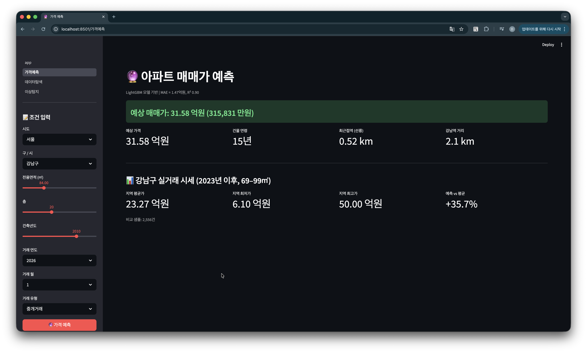
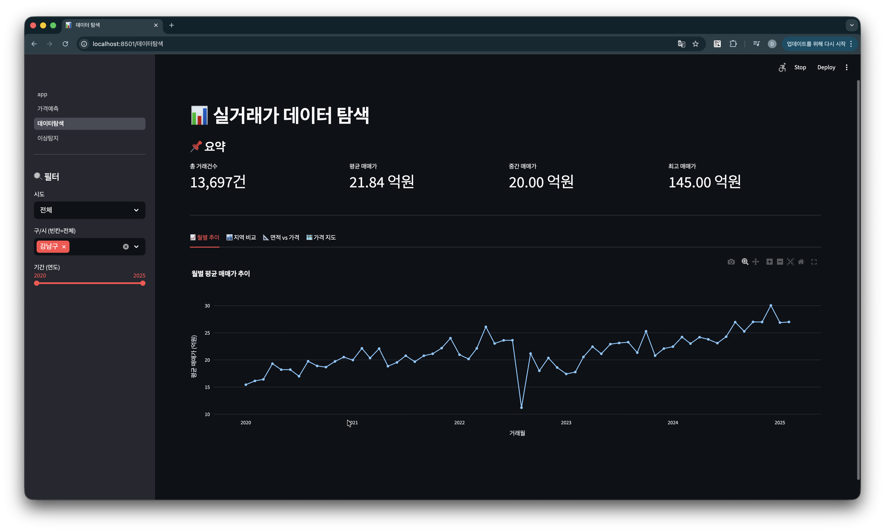
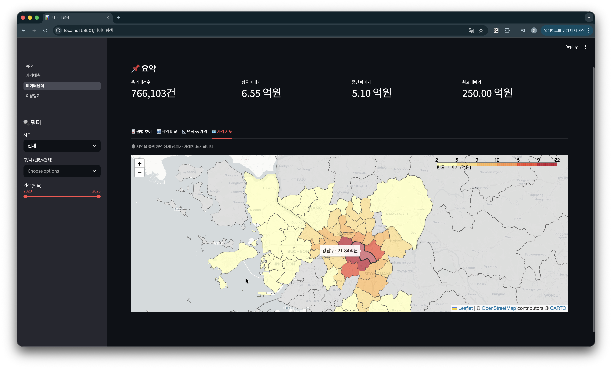
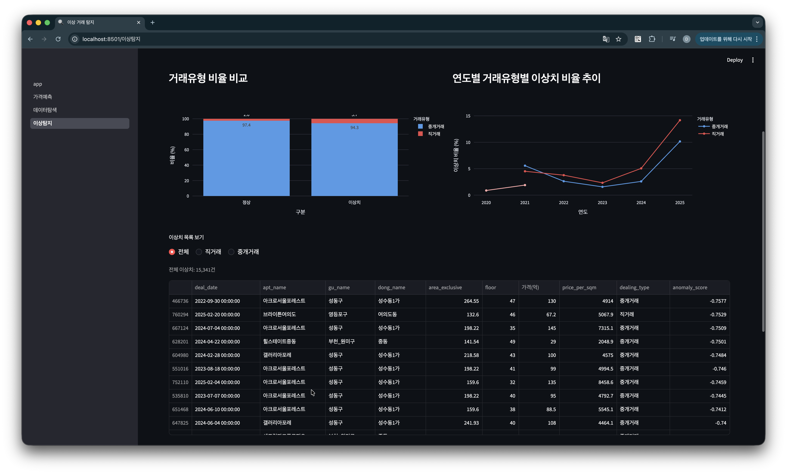
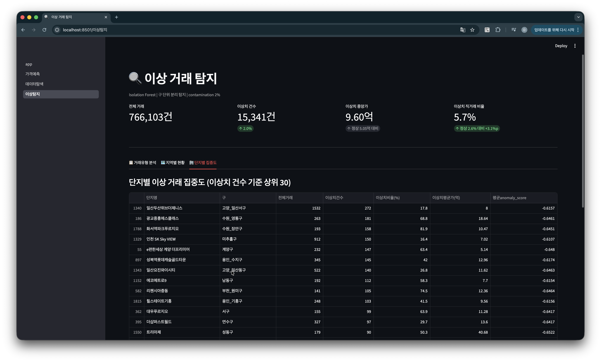

# 🏠 한국 아파트 실거래가 분석 파이프라인

국토교통부 실거래가 API로 수도권 아파트 매매 데이터를 수집하고,  
Kakao 지오코딩 + 공간 피처 엔지니어링 + LightGBM으로 가격을 예측하며,  
Isolation Forest로 이상 거래를 탐지하는 end-to-end 데이터 파이프라인입니다.

> **데이터**: 수도권 아파트 매매 766,103건 (2020.01 – 2025.02)

---

## 📸 대시보드 스크린샷

<!-- 스크린샷 추가 예정 -->
| 가격 예측 | 월별 가격 추이 |
|-----------|--------------|
|  |  |

| 가격 지도 (Choropleth) | 이상탐지 — 거래유형 분석 |
|-----------------------|--------------------------|
|  |  |

| 이상탐지 — 단지별 집중도 | |
|--------------------------|--|
|  | |

---

## 🔍 주요 인사이트

### 1. 가격 예측 모델 (LightGBM)

| 분리 방식 | MAE | R² | 의미 |
|----------|-----|----|------|
| 시계열 (cutoff 2024-01-01) | **1.47억원** | **0.90** | 학습 단지 포함 |
| 단지 단위 분리 (unseen 20%) | **1.54억원** | **0.85** | 미학습 단지 예측 |

- 단지 분리 기준 R² 0.85 — 위경도 암기 효과를 제거해도 실질적인 일반화 성능 확인
- 7개 모델 비교(LightGBM / XGBoost / RandomForest / ExtraTrees / GradientBoosting / Ridge / ElasticNet) 중 LightGBM 최우수

**피처 중요도 (상위 5개)**

| 순위 | 피처 | 설명 |
|------|------|------|
| 1 | `latitude` | 위도 (남북 위치) |
| 2 | `longitude` | 경도 (동서 위치) |
| 3 | `dist_to_gangnam_km` | 강남역까지 직선 거리 |
| 4 | `building_age` | 건물 연령 |
| 5 | `area_exclusive` | 전용면적 |

> 위치 피처(위도·경도·강남 거리)가 가격의 40% 이상을 설명 — 한국 부동산 시장에서 입지의 압도적 영향력 확인

---

### 2. 이상 거래 탐지 (Isolation Forest, 구 단위 분리)

> **핵심 발견: 이상 거래에서 직거래 비율이 2.2배 높다**

| 구분 | 건수 | 중앙 거래가 | 직거래 비율 |
|------|------|------------|------------|
| 정상 거래 | 750,762건 | **5.05억** | 2.6% |
| 이상 거래 | 15,341건 | **9.60억** | **5.7%** |

**탐지 방법**
- 전체를 한 분포로 보면 강남 고가 아파트가 단순히 이상치로 분류됨
- **구 단위 분리 탐지**로 각 지역 내 시세 기준의 진짜 이상 거래를 탐지
- 활용 피처: 거래가, 평당가, 전용면적, 층, 건물연령, 거래월, 위치 거리 피처

**이상 거래 해석**
- 직거래 비율 5.7% — 특수관계인 간 저가 거래 또는 급매의 패턴
- 이상치 중앙가 9.60억 — 단순 고가가 아닌 해당 구 내 시세 이탈 거래
- 특정 단지에 이상 거래 집중 현상 존재

---

### 3. 공간 피처 엔지니어링

위경도 좌표에서 다음 거리 피처를 생성하여 모델 성능을 향상시켰습니다.

| 피처 | 설명 | 계산 방법 |
|------|------|----------|
| `dist_to_gangnam_km` | 강남역까지 직선 거리 | Haversine |
| `dist_to_subway_km` | 최근접 지하철역까지 거리 | 수도권 ~200개역 기준 |
| `dist_to_cityhall_km` | 최근접 시청/구청까지 거리 | 서울·경기·인천 청사 기준 |

- `dist_to_gangnam_km`: 단순 교통 편의가 아닌 강남 프리미엄 권역과의 거리 (학군·직주근접·자산가치 proxy)
- `dist_to_subway_km`: 역세권 프리미엄 정량화

---

## 🛠 기술 스택

| 영역 | 사용 기술 |
|------|----------|
| 데이터 수집 | Python `requests`, `xml.etree.ElementTree`, `tenacity` |
| 저장 | `SQLite` (증분 저장, UNIQUE 제약으로 중복 방지) |
| 지오코딩 | `Kakao Local API`, `VWorld API` (fallback) |
| 공간 분석 | `geopandas`, `shapely`, `numpy` (Haversine 벡터화) |
| ML | `LightGBM`, `XGBoost`, `scikit-learn`, `Optuna` |
| 이상탐지 | `sklearn.ensemble.IsolationForest` |
| 시각화 | `Streamlit`, `Plotly`, `Folium` |
| CLI | `Click` |
| 로깅 | `Loguru` |

---

## 📁 프로젝트 구조

```
realestate/
├── src/realestate/
│   ├── config.py        # API 키, 지역코드, 경로 설정
│   ├── collector.py     # MOLIT API 수집 (XML 파싱, pagination, retry)
│   ├── preprocessor.py  # 컬럼 정제, 파생 변수 생성
│   ├── storage.py       # SQLite 증분 저장 (apt_trade / apt_geocode / apt_anomaly)
│   ├── geocoder.py      # Kakao/VWorld 지오코딩 (배치, 캐시)
│   ├── spatial.py       # 공간 피처 생성 (지하철·구청 거리, 시군구 조인)
│   ├── ml.py            # MLPipeline (학습, Optuna HPO, 모델 비교, 이상탐지)
│   └── main.py          # Click CLI
├── pages/
│   ├── 1_가격예측.py    # LightGBM 예측 + 지역 시세 비교
│   ├── 2_데이터탐색.py  # 월별추이 / 지역비교 / 면적산점도 / 가격지도
│   └── 3_이상탐지.py    # 거래유형 분석 / 지역별 현황 / 단지별 집중도
├── app.py               # Streamlit 홈
├── .env.example
└── requirements.txt
```

---

## ⚡ 빠른 시작

### 1. 환경 설정

```bash
git clone https://github.com/lh922j/realestate.git
cd realestate
python -m venv .venv && source .venv/bin/activate
pip install -r requirements.txt
cp .env.example .env    # API 키 입력
```

### 2. API 키 발급

**MOLIT API** — [data.go.kr](https://www.data.go.kr) → 아파트매매 실거래 상세 자료 → **일반 인증키(Decoding)**

**Kakao API** — [developers.kakao.com](https://developers.kakao.com) → REST API 키 → 제품 설정 → **카카오맵 지도/로컬 활성화**

### 3. 파이프라인 실행

```bash
# 데이터 수집
python -m src.realestate.main collect --type trade --region 수도권 --start 202001 --end 202502

# 지오코딩
python -m src.realestate.main geocode --region 수도권

# ML 학습
python -m src.realestate.main train --model lgbm --cutoff 2024-01-01 --importance

# 이상 탐지
python -m src.realestate.main anomaly --region 수도권 --contamination 0.02

# 대시보드
streamlit run app.py
```

---

## 📊 CLI 명령어

| 명령어 | 설명 |
|--------|------|
| `collect` | MOLIT API 데이터 수집 (매매/전월세) |
| `geocode` | 단지별 위경도 좌표 확보 (Kakao) |
| `train` | ML 모델 학습 (lgbm/xgboost/ridge, Optuna HPO, 7모델 비교) |
| `anomaly` | Isolation Forest 이상 거래 탐지 (구 단위 분리) |
| `stats` | DB 현황 출력 |
| `export` | CSV 내보내기 |
| `test-api` | API 연결 테스트 |

---

## 🗒 설계 결정

**왜 SQLite인가?**  
수집→전처리→ML→대시보드 전 파이프라인이 단일 파일로 관리됩니다. UNIQUE 제약으로 중복 없이 증분 수집이 가능하며, RAG/AI Agent 연동 시 SQL 인터페이스를 그대로 활용할 수 있습니다.

**왜 구 단위 이상탐지인가?**  
수도권 전체를 단일 분포로 보면 강남 고가 아파트가 단순히 이상치로 분류됩니다. 구 단위로 분리하면 각 지역의 시세 분포를 기준으로 실제 이상 거래(직거래 급매, 특수관계인 거래 등)를 탐지할 수 있습니다.

**왜 Haversine인가?**  
좌표를 평면으로 보는 유클리디안 거리는 위도에 따라 경도 1도의 실제 거리가 달라지는 문제가 있습니다. Haversine은 지구 구면을 고려한 실제 km 단위 거리를 계산합니다.

---

## 🔮 향후 계획

- [ ] LSTM 기반 지역별 월평균 가격 시계열 예측
- [ ] RAG 기반 부동산 Q&A AI Agent (LangChain + ChromaDB)
- [ ] 전월세 전환율 분석 및 갭투자 리스크 지표
